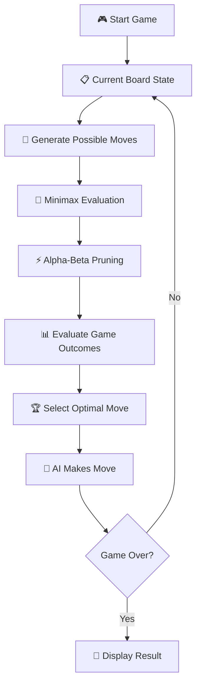
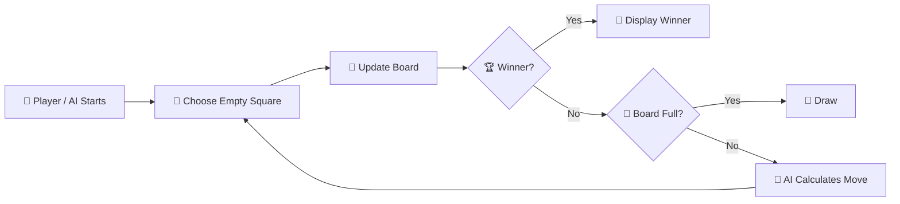

# 🎮 Tic-Tac-Toe AI — CodSoft Task 2

> An interactive **AI-powered Tic-Tac-Toe game** built with Python and Streamlit, using the **Minimax algorithm with Alpha-Beta Pruning** to make optimal decisions.

---

## 🎯 Project Overview

This project is developed as **Task 2** of the **CodSoft Artificial Intelligence Internship**.

The application allows a human player to compete against an AI opponent in Tic-Tac-Toe. The AI evaluates possible future game states using **Minimax** and improves the search efficiency using **Alpha-Beta Pruning**.

---

## ✨ Features

| Feature | Description |
|---|---|
| 🎮 Human vs AI | Play Tic-Tac-Toe against an AI opponent |
| 🧠 Minimax Algorithm | Evaluates possible game outcomes |
| ⚡ Alpha-Beta Pruning | Reduces unnecessary game-tree searches |
| 🔄 New Game | Starts a fresh round |
| 📊 Score Tracking | Keeps track of wins, losses, and draws |
| 🏆 Optimal Play | AI selects the best available move |
| 👤 Flexible Start | Human or AI can start the game |
| 🎨 Interactive UI | Colorful and responsive Streamlit interface |
| 📖 Game Rules | Built-in explanation of how to play |
| 💡 AI Explanation | Explains how Minimax and Alpha-Beta Pruning work |

---

## 🛠️ Technologies Used

| Technology | Purpose |
|---|---|
| 🐍 Python | Core programming language |
| 🎈 Streamlit | Interactive web application |
| 🧠 Minimax | AI decision-making algorithm |
| ✂️ Alpha-Beta Pruning | Efficient game-tree search |
| ➗ Math | Mathematical utility functions |

---

## 🧠 AI Method

### Minimax Algorithm

Minimax is a decision-making algorithm used in two-player games.

The AI evaluates possible future moves and assigns values to different game outcomes:

- 🏆 Win → positive score
- ❌ Loss → negative score
- 🤝 Draw → neutral score

The AI selects the move that provides the best guaranteed outcome.

### ⚡ Alpha-Beta Pruning

Alpha-Beta Pruning improves Minimax by eliminating branches of the game tree that do not need to be evaluated.

This allows the AI to search more efficiently while preserving the decision produced by Minimax.

---

## 🔄 How the AI Works



---

## 🔁 Game Flow



> 💡 The flowcharts use Mermaid so they can render directly on GitHub.

---

## 📌 Game Rules

1. ❌ The human player uses **X**.
2. ⭕ The AI player uses **O**.
3. Players take turns selecting an empty square.
4. Three matching symbols in a row, column, or diagonal win the round.
5. If all nine squares are filled without a winner, the round ends in a draw.

---

## 🏗️ Project Structure

```text
Task2_TicTacToe/
│
├── tic_tac_toe.py
├── requirements.txt
└── README.md
```

---

## ▶️ How to Run Locally

### 1. Clone the Repository

```bash
git clone https://github.com/Anjala30/CODSOFT_TASKSNO.git
```

### 2. Open the Task 2 Folder

```bash
cd CODSOFT_TASKSNO/Task2_TicTacToe
```

### 3. Install Requirements

```bash
pip install -r requirements.txt
```

### 4. Run the Application

```bash
streamlit run tic_tac_toe.py
```

The application will open in your browser.

---

## 🌐 Live Demo

🚀 **Play the deployed game here:**

👉 [https://tictactoe0py-mjubdx2qdgf6mpphehygx9.streamlit.app/](https://tictactoe0py-mjubdx2qdgf6mpphehygx9.streamlit.app/)

---

## 🎮 Application Highlights

| Section | Purpose |
|---|---|
| ⚙️ Game Settings | Select who starts the game |
| 📊 Scoreboard | View game statistics |
| 🎯 Game Board | Play against the AI |
| 🧠 How the AI Works | Understand Minimax and Alpha-Beta Pruning |
| 📖 Game Rules | Learn the rules of Tic-Tac-Toe |
| 🔄 New Game | Start another round |
| 🧹 Reset Score | Reset the complete score |

---

## 🧪 Testing

The application was tested through multiple game rounds to verify:

- ✅ Human moves
- ✅ AI moves
- ✅ Human-start mode
- ✅ AI-start mode
- ✅ Win detection
- ✅ Draw detection
- ✅ New Game functionality
- ✅ Score updates
- ✅ Reset Score functionality
- ✅ Minimax decision-making
- ✅ Alpha-Beta Pruning integration
- ✅ Live Streamlit deployment

---

## 🎓 Internship Information

| Details | Information |
|---|---|
| 🏢 Organization | CodSoft |
| 💼 Program | Artificial Intelligence Internship |
| 📌 Task | Task 2 — Tic-Tac-Toe AI |
| 🧠 Algorithm | Minimax + Alpha-Beta Pruning |
| 👩‍💻 Developer | Anjala William Chandanshiv |

---

## 🚀 Future Improvements

- 🎨 Add multiple difficulty levels
- 📱 Improve mobile responsiveness
- 🤖 Add different AI strategies
- 🏅 Add a leaderboard
- 🔊 Add sound effects and animations

---

## ⭐ Conclusion

This project demonstrates how **Artificial Intelligence can be applied to game playing** using search-based decision-making.

By combining **Minimax** with **Alpha-Beta Pruning**, the application can evaluate possible future moves and select an optimal move while reducing unnecessary computation.

---

### 💜 CodSoft Artificial Intelligence Internship

**Task 2 — Tic-Tac-Toe AI** 🎮🧠
